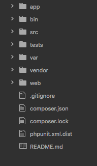

# Structure d'une application symfony

##### 1. Ca ressemble à ça...

- `app/`: Contient toute la configuration de votre application, et également les templates propre à tous les bundles.  
Bonne pratiques: Pas de code php dans le dossier app

- `bin/`: Contient les script de la console Symfony et autre executable du framework.
La console Symfony est accessible via le terminal en tapant pour les versions 3.* `php bin/console`

- `src/`: C'est ici que se trouvera le coeur de votre application sous forme de bundle, on y retrouvera, nos templates, controllers, entitée (class), route, service... C'est dans le dossier que l'on va passer le plus clair de notre temps.

- `tests/`: Dossier dans lequel les tests automatisés seront réalisé

- `var/`: Le contenu de se dossier est automatiquement créé, c'est ici que Symfony enregistre le cache, les logs et sessions.  
On a déja parlé de ce dossier lors de la mise en place des droits ([cf 5_les_droits.md](5_les_droits.md))

- `vendor/`: C'est ici que sont stoqué toutes les dépendances de votre application géré par composer.  
On ne modifie rien dans se dossier, si on doit y faire des modification, on fonctionne via de l'héritage ou encore des bundles enfants

- `web/`: C'est le dossier public de l'application, on y mettre tous les éléments accessible par le public (js, css, images....)

- `.gitignore`: gitignore du projet, généré automatiquement par Symfony, permet d'ignorer le staging du cache, des vendor, de vos parametres de base de donnée...  
En cas de besoin, ne pas hesiter à le mettre à jour.

- `composer.json`: Référence toutes les dépendances de l'application, utiliser par composer lors de l'install ou la mise à jour

- `composer.lock`: log de composer, généré automatiquement

- `phpunit.xml.dist`: Fichier utiliser par le framework de test phpunit

- `README.md`: readme de votre app

*src: http://symfony.com/doc/current/page_creation.html*
